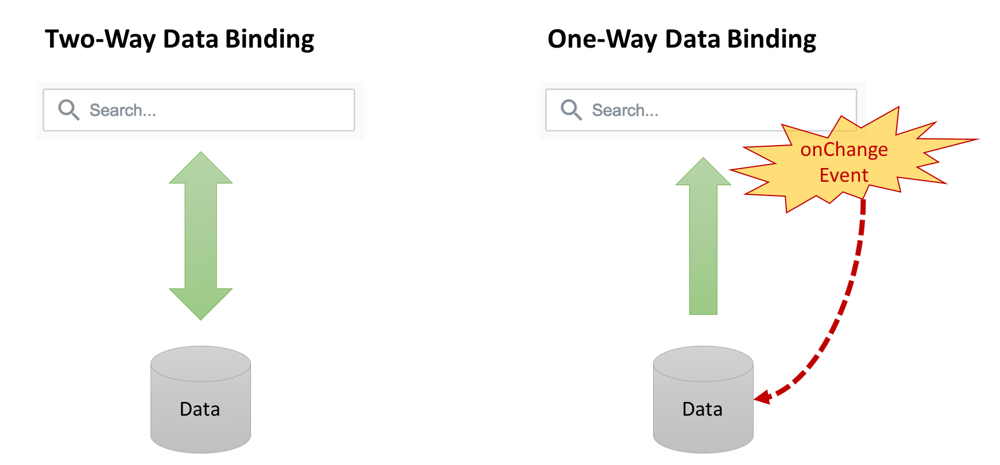

# React

A JavaScript library for building user interfaces.


Note: Not a framework. Only the V, or view.

---


Note: Allows you to break up your web applications into individual UI components, and have those components **independently** update based on the data, or state, of the application. Walk through mock up and declarative components.

---

## Why is React so Cool?

- **FAST**... lightweight library + virtual DOM
- **Atomic design** with reusable components (designers &#x1F493; it)
- **One-way data flows**
- **One true representation of a view**

Note: Virtual DOM that only updates the parts of the DOM that changed rather than re-rendering the entire DOM. Not opinionated about the other stuff, keeping it lightweight but also flexible so it can be integrated with many other tools. Build once, use many times. [This is a great article](http://bradfrost.com/blog/post/atomic-web-design/) on the concept of atomic design. **One-way** less prone to bugs and easier to maintain. **One rep** markup (HTML) and behavior (JavaScript) are located in the same file. Some may argue against this advantage, but think about why we separate the markup from the behavior... Is it really separation of concerns or is it primarily because the available tools had to be written in different languages, and thus different files?

-v-



Note: Data can only flow one way to render views. Events are used to trigger changes in data that then flows down to update the view. As we will see later, because of the additional control it gives to the developer, this architecture is less prone to bugs and easier to maintain than an architecture where data can flow up from the view as well. One-way data binding is much more functional in nature, so if you're a fan of functional programming, React will be fun.

-v-

According to the [State of JavaScript 2016](http://stateofjs.com/), **92%** of developers who have used React would use it again, the *highest percentage* for all frameworks surveyed.

Note: Languages and tools may go in and out of style, but React seems to be winning the front-end race right now. It’s a joy to work with, and for many developers, quicker to pick up than some of the other front-end tools out there.

---

Time to jump on the React bandwagon!


-v-

## Getting Started

- JSX
- Rendering
- Components
- Props
- ES6

Note: ES6: destructuring, module imports and exports, and arrow functions. Setting up a React app can be a bit of a pain - a lot of boilerplate code to set up React + Babel + Webpack build. So we use Codepen and Create React App.

-v-

## Hello, React!

```
<!-- HTML -->
<div id="app"></div>
```

```
// JavaScript
class App extends React.Component {
  render() {
    return (
      <h1>Hello, React!</h1>
    )
  }
}

ReactDOM.render(<App />, document.getElementById('app'))
```

<small>[See it on Codepen.io](https://codepen.io/nolasia/pen/NdoQMb)</small>

Note: 1. write the target HTML div. 2. Create a class based on the React Component base class, with a function `render` which defines what to render whenever we instantiate the App component. Just a short block of markup using JSX, or JavaScript XML. 3. Go look for the HTML element with an `id` of `"app"`, then render the `<App />` React component in its place. In JSX, all self-closing tags must have / before closing caret.

---

## What is JSX?

```
<!-- HTML -->
<h1>Hello, React!</h1>
```

```javascript
// JavaScript with JSX
const title = <h1>Hello, React!</h1>
```

```javascript
// JavaScript without JSX
// Syntax for the React.createElement function
React.createElement(component, props, ...children)`

// Our title written without JSX using React.createElement
const title = React.createElement(
  'h1',
  {},
  'Hello, React!'
)
```

Note: JSX = JavaScript XML. Technically, it is a preprocessor that adds XML syntax to JavaScript. In React, JSX is simply "syntactic sugar" for the `React.createElement()` function. JSX is optional in React, but here as in most of the industry, we use it for the simplicity it provides us.

-v-

### Dynamic JSX

```javascript
// Use curly brackets to embed JS expressions inside JSX
const person = {
  name: 'Harry',
  phone: '504-555-1212'
}

const card = (
  <div className="well">
    <h1>{person.name}</h1>
    <dl>
      <dt>Phone</dt>
      <dd>{person.phone}</dd>
    </dl>
  </div>
)
```

Note: JSX is simply JavaScript until after it is compiled. This means that we can use it to make dynamic elements as well as pass it around and return it from functions.

-v-

### Dynamic Attributes (part 1)

```javascript
// Make dynamic attributes by using curly brackets
const iconClass = "glyphicon glyphicon-star"
const icon = (
  <span className={iconClass} aria-hidden="true"></span>
)
```

Note: We can also make dynamic attributes by using curly brackets. For example, maybe we want a generic icon (using [Bootstrap glyphicons](http://getbootstrap.com/components/#glyphicons)) that sets the `className` based on which icon we want.

-v-

### Dynamic Attributes (part 2)

```javascript
// String interpolation for className...
// Note how to break up the props over multiple lines
const iconName = "star"
const icon = (
  <span
    className={`glyphicon glyphicon-${iconName}`}
    aria-hidden="true"
  ></span>
)
```

Note: If we take that one step further, the icon classes are pretty repetitive - we only need part of the `className` to change. In this case, we can use string interpolation to only have to feed the core icon name to our reusable icon.

### Some Basic JSX Rules for Happy Compilation &#x1F601;

- Use `className` for `class`, and `htmlFor` for `for`.
- Self-closing elements must use a forward slash before the closing bracket: ``
- Ensure your closing tags are in the correct location.
- Use parentheses around multi-line nodes.

---

## Rendering and Components

```
<!-- HTML: Root DOM node, usually 1 per application -->
<div id="app"></div>
```

```javascript
// JavaScript
class App extends React.Component {
  render() {
    return (
      <h1>Hello, React!</h1>
    )
  }
}

ReactDOM.render(<App />, document.getElementById('app'))
```

-v-

### ReactDOM render function

```javascript
// Typical ReactDOM render function called
ReactDOM.render(<App />, document.getElementById('app'))
```

```javascript
// ReactDOM.render accepts 3 arguments:
ReactDOM.render(
  element,
  container,
  [callback]
)
```

<small>Check out the [React API documentation](https://facebook.github.io/react/docs/react-dom.html#render)</small>

Note: `element` - which element to render. `container` - which HTML container element/root dom node (usually a `div`) to replace the contents of with the element supplied in the first argument. `callback` - optional function that will run upon completion of the render or update.

-v-

### Components

- Represent **individual pieces** of the user interface
- Write **reusable** components to build a toolbox
- *e.g., buttons, cards, etc.*

-v-

### Functional vs Class Components

```javascript
// Class component inheriting from React.Component
class App extends React.Component {
  render() {
    return (
      <h1>Hello, React!</h1>
    )
  }
}

// Same component, written as a function
const App = () => (
  <h1>Hello, React!</h1>
)
```

<small>For a refresher on arrow functions, see the [MDN documentation](https://developer.mozilla.org/en-US/docs/Web/JavaScript/Reference/Functions/Arrow_functions).</small>

Note: Components can be written as functions or classes inheriting from `React.Component` and accept one input - `props`. If we look at our very basic `App` component from **Hello, React!**, here are both the functional and class ways to define that component. functional component is much more concise. Sometimes functional components are referred to as "stateless" components. We will learn more about `state` later. Class components are more powerful, and we will see why when we learn about `state`. Remember that at their core, both functional and class components take `props` as an input and return elements. Now let's look more closely at `props`...

-v-

<h3 style="text-transform: lowercase;">`props`</h3>

- One of two ways of managing model data in React
- Pass data from parent elements to child elements
- **Immutable** - you may not change them!
- Key way we create reusable components...

<small>Read more about [Thinking in React](https://facebook.github.io/react/docs/thinking-in-react.html)</small>

Note: May only pass them from higher level components to lower level components. We will learn how to handle mutable data with state.

-v-

```javascript
// Reusable Button component (functional component)
const Button = (props) => {
  const {size, color, children} = props
  const sizeClass = size ? `btn-${size}` : ''

  return (
    <button
      type="button"
      className={`btn btn-${color} ${sizeClass}`}
    >
      {children}
    </button>
  )
}

// Core App component
const App = () => (
  <div className="container">
    <h1>Fun With Reusable Buttons</h1>

    <h2>Colors</h2>
    <Button color="default">Submit</Button>
    <Button color="primary">Primary</Button>
    <Button color="success">Success</Button>
    <Button color="warning">Warning</Button>
    <Button color="danger">Danger</Button>

    <h2>Sizes</h2>
    <Button color="default" size="lg">Large</Button>
    <Button color="default">Default</Button>
    <Button color="default" size="sm">Small</Button>
  </div>
)
```

Note: For example, if we are using [Bootstrap](http://getbootstrap.com/css/#buttons) and want to build a reusable `Button` component that still gives us the flexibility to select color and size at the time of use, we could write the following

-v-


-v-

### Default Props

```javascript
// Functional component
const Button = (props) => {
  // Button code
}

// Default props for above component
Button.defaultProps = {
  color: 'default',
  children: 'Submit'
}
```

<small>To learn more about default props and type checking, refer to the [React docs](https://facebook.github.io/react/docs/typechecking-with-proptypes.html#default-prop-values)</small>

Note: By setting default values, we can offer our developers an even more convenient way to call components by setting up default props with the most commonly used attributes. For example, we can simply call `<Button />` and it will now return a button with the default color class and with the text "Submit".

-v-

### Composition

As in our `Button` example, the output of one component (App) can call other components (Button). In other words, we can compose our application by building and referring to multiple components.

<small>[Composition vs Inheritance in React](https://reactjs.org/docs/composition-vs-inheritance.html)</small>

Note: This is a key design principle in React

-v-


Note: Your UI and design-thinking skills will come in quite handy when building React applications. Remember looking at a website or mockup and breaking it down into the different elements to build in HTML and CSS? Composing React applications works very similarly.

-v-

#### When in doubt, extract a component!

Note: Long, deeply-nested, and/or complex outputs for components are more difficult to not only build but maintain. In addition, any portion of a component that can be reused is a good candidate for extracting into a separate more generic component.

-v-

### Side-Note on Destructuring

```javascript
// Original destructured props
// Less verbose! Quicker to read and understand!
const {size, color, children} = props

// Same result, without destructuring
const size = props.size
const color = props.color
const children = props.children
```

Note: Destructuring in ES6 deserves a minute of our time as you will see a lot of it in the land of React.

-v-

### Destructuring in Function Arguments

```javascript
// Original Button
const Button = (props) => {
  const {size, color, children} = props
  const sizeClass = size ? `btn-${size}` : ''

  return // ...
}

// Move destructuring of props into the arguments
const Button = ({size, color, children}) => {
  const sizeClass = size ? `btn-${size}` : ''

  return // ...
}
```

---

## Create React App

[Create React App](https://github.com/facebookincubator/create-react-app) is an opinionated React app generator created by Facebook which only requires a few simple commands to get you running locally.

```bash
$ npm install -g create-react-app
$ create-react-app [app-name]
$ cd [app-name]
$ npm start
```

<!-- TODO: add exploring the file structure and 1 component for file -->

-v-

### ES6 Modules: Imports

```javascript
// index.js
import React from 'react';
import ReactDOM from 'react-dom';
import App from './App';
import './index.css';

ReactDOM.render(
  <App />,
  document.getElementById('root')
);
```

Note: Modules are a very handy feature in ES2015. They allow us to export and import between multiple files. The first two import statements for `React` and `ReactDOM` are importing from the node modules for React and ReactDOM. The third imports our `App` component using relative paths from the same folder. All three of those import statements allow us to call those modules directly within this file.

-v-

### ES6 Modules: Default Exports

```javascript
// App.js
import React, { Component } from 'react';
import logo from './logo.svg';
import './App.css';

class App extends Component {
  render() {
    return (
      // ...
    );
  }
}

export default App;
```
Note: The import statements at the top are very similar to the ones in *index.js*, except that we now have a bit of destructuring on line 1. Previously, we created our React classes by extending `React.Component`. We can destructure `React` inside the import statement to access `Component` directly without prepending with `React.`

-v-

### ES6 Modules: Exports Compared

```javascript
// Single module export
export default App

// Single module import (from an export default statement)
import App from './[relative path]'

// Multiple exports
export Button
export Icon

// Import from a non-default export
import {Button} from './[relative path]'
```

<small>See the [docs for `import`](https://developer.mozilla.org/en-US/docs/Web/JavaScript/Reference/Statements/import) by MDN</small>

Note: When a module exports only a single thing, here `App`, we use `export default App`. If we had a module that exported multiple things, we would need to remove the word `default` and modify our import statements in other files.

---

## State & Lifecycle Methods

- Component `state`
- Component lifecycle methods
- Building apps with state

-v-

### Events and State

- To access `state` and other related features for a component, we must use a **class-based component**.
- A good rule of thumb is to use only **functional components** until you need the ability to use state.

-v-

### State... The Other Data Source

`props` are the immutable data that a component requires to render correctly & should <span style="text-decoration: underline;">always</span> be the go-to method for handling data in a component *until you need to change that data*, like based on a click event.

-v-

```javascript
// Static stop and go component with initial state set
class StopAndGo extends React.Component {
  // Add a constructor method to initialize state
  constructor() {
    // Call super to initialize `this`
    super()
    // Initialize state
    this.state = { color: 'success', message: 'GO!' }
  }

  render() {
    // Access state values with this.state
    const {color, message} = this.state
    return <FlashMessage type={color}>{message}</FlashMessage>
  }
}
```

Note: To initialize state, we need to add a `constructor()` method to our class. At this point, our component is static. Now we can add a user event to update that state...

-v-

### User Events in React vs HTML DOM elements

<div style="font-size: 75%">
<em>A few minor differences:</em>

<ul>
  <li>Use camelCase for naming events instead of lowercase (e.g., `onClick`).</li>
  <li>The event accepts a function as an argument instead of a string (e.g., `onClick={myClickFunction}`).</li>
  <li>To prevent default behavior, you must call `preventDefault()` on the event within the click function.</li>
</ul>

</div>

-v-

### Changing State With User Events

To change the component `state`, we call:

```javascript
this.setState(nextState, callback)
```

<div style="font-size: 80%; color: #FFFFE0;">
&#x1F31F; Note that `setState()` is **asynchronous!** &#x1F31F;
</div>

Note: The first argument is the new state values to be merged with the old ones. You do not have to provide all the state values - only the ones to be changed. The second argument is an optional callback function to run upon completion of the state update.

-v-

```javascript
class StopAndGo extends React.Component {
  constructor() {
    //..
  }

  // Create click handler
  handleClick = () => { console.log('clicking') }

  render() {
    // ...
    // Add a wrapper div containing the click event
    return (
      <div onClick={this.handleClick}>
        <FlashMessage type={color}>{message}</FlashMessage>
      </div>
    )
  }
}
```

-v-

```javascript
  handleClick() {
    if (this.state.color === 'success') {
      this.setState({
        color: 'danger',
        message: 'STOP!'
      })
    } else {
      this.setState({
        color: 'success',
        message: 'GO!'
      })
    }
  }
```

-v-

### Binding Functions to <span style="text-transform: lowercase;">`this`</span>

1. In the constructor with:
```
this.handleClick = this.handleClick.bind(this)
```
2. As an arrow function called directly in the render with:
```
<div onClick={() => this.handleClick}>
```
3. As an arrow function when defining the handler:
```javascript
handleClick = () => {...}
```

Note: Our component functions need access to the correct `this` to call `this.setState` in our user event handlers. 1 is totally acceptable. It works in base ES2015 and binds the function efficiently upon instantiation of the component. 2 is definitely shorter, but not sweeter. It creates brand new functions every time `render` is called, rather than only with the class is instantiated. Luckily, the third option is both shorter and sweeter. We just have to add a stage-2 features to our Babel preprocessor for it to work.

---

### Lifecycle Methods


<small>Read the docs starting [here](https://facebook.github.io/react/docs/react-component.html#componentwillmount)!</small>

Note: When React components are created, updated, and removed from the DOM, they undergo various steps in the process. These steps are called the lifecycle methods, and we can hook into them as needed.
- **constructor()** where we initialize state.
- **componentWillMount()** invoked immediately before mounting, and has some catches. Avoid side effects here. Generally we use the `constructor` or `componentDidMount` instead.
- **componentDidMount()** where to initialize something that requires DOM nodes to exist before setting it.
- **componentWillReceiveProps()** Hook into this if the state needs to update based on prop changes.
- **shouldComponentUpdate()** By default, returns `true`. Hook into it when changes in props or state should not trigger a re-render.
- **componentWillUpdate()** Similar to `componentWillMount`, invoked immediately before updating, and has some catches. You cannot use `this.setState` here.
- **componentDidUpdate()** Similar to `componentDidMount`, where to update something that requires DOM nodes to be updated before setting it. Handy for when you want to only perform a network request if the component updated (by comparing props before and after).
- **componentWillUnmount()** called immediately before removing from the DOM and destroying. Perfect place for cleanup such as clearing timers, canceling requests, etc.

-v-

```javascript
// Stop and go component cycling on a timer
class StopAndGo extends React.Component {
  constructor() {
    super()
    this.state = { color: 'success', message: 'GO!' }
  }

  // Initialize the timer after rendering complete
  componentDidMount() {
    this.timer = setInterval(
      // Arrow function here binds to correct `this`
      () => this.switchLight(),
      5000
    )
  }

  // Clear our timer before removing component
  componentWillUnmount() {
    clearInterval(this.timer)
  }

  // Renamed our handle since no longer triggered on click
  switchLight() {
    console.log('clicking')
    if (this.state.color === 'success') {
      this.setState({
        color: 'danger',
        message: 'STOP!'
      })
    } else {
      this.setState({
        color: 'success',
        message: 'GO!'
      })
    }
  }

  render() {
    const {color, message} = this.state
    // Removed onClick and wrapper div
    return (<FlashMessage type={color}>{message}</FlashMessage>)
  }
}
```

---

### Building Apps with state

1. Create a *component hierarchy* from the mockup
2. Build a *simple, static* version first
3. List all the *data* needed in state
4. Place and *initialize state* then *create events*

<small>Read [Thinking in React](https://facebook.github.io/react/docs/thinking-in-react.html)</small>

Note: Most of these concepts are covered in [Thinking in React](https://facebook.github.io/react/docs/thinking-in-react.html) which includes a tutorial. However, the process is not always linear. This is a general guide, but frequently you will build individual features at a time, not the entire application at once.

