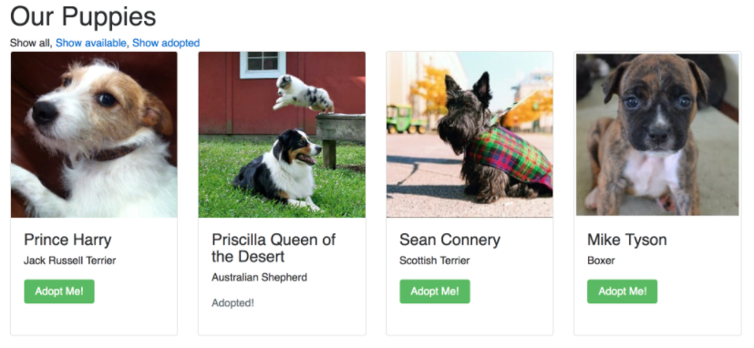

# React + Redux
## Sia Karamalegos

-v-

# React + Redux

A fine combination


Note: What use is Redux without a user-facing application? We learned Redux to better manage our state in our React apps, so it's time to start using it as such. Remember, Redux is not exclusive to React and can be used with many JavaScript front-end libraries or even vanilla JavaScript.

-v-

## What do our React components need from Redux?

Note: If you answered **state** and **actions**, then you're right on the money!

-v-

## React Redux

You could write all your React + Redux code yourself using `store.subscribe()`, but the [React Redux](https://github.com/reactjs/react-redux) package comes with helper methods that are also more performant.

-v-

## React Redux Data Flows

**Data still always flows one-way:**

1. Dispatch an action from the view.
2. Maybe dispatch functions or other actions from that action.
3. The reducer listens for the actions and returns a new state to the store.
4. The view listens for updates to the store and receives the new state.

-v-


Note: Dispatch an action from the view. The reducer listens for the actions and returns a new state to the store. The view listens for updates to the store and receives the new state.

-v-

## What are we learning about?

### React + Redux

- Components vs Containers
- Building Containers
- Async Actions

---

# Components vs Containers

-v-

> **Containers** manage or connect to state and actions, while **presentational components** render based on props only.

Note: This is a good pattern for both larger applications with deeper component trees (multiple levels) as well as any React application which uses Redux.

-v-

## Presentational Components

- Primarily concerned with the "presentation", or how things look.
- Go by many names, including stateless functional, dumb, stateless, skinny, and functional (though in the future, [functional components can have state](https://twitter.com/sebmarkbage/status/658713924607606784)).
- Should almost always be functional components.
- All the data (from state) and actions they need are passed to them as props.
- Thus, very easy to test!

Note: They should rarely be class-based, and usually do not have their own state. Any state would be solely used for UI purposes, though many developers prefer this to be stored in Redux as well.

-v-

## Containers

- Primarily concerned with how things work.
- Go by many other names including smart, class-based, stateful, and fat components.
- In Redux apps, they connect with the store to link state and provide dispatch actions.
- Always class-based components.
- Generally, the render method should be minimal.

Note: It usually only calls a presentational component with a corresponding name. For example, the `AppContainer` would render the `App` component.

-v-

## Separation Pattern Benefits

- Better separation of concerns
- Easier to recognize code smells
- Greater reusability for presentational components
- Designers love presentational components because of [atomic design](http://bradfrost.com/blog/post/atomic-web-design/).
- Less fragility if the shape of the data structure changes.
- Easier testing!

Note: (1) One focuses on the user interface, and the other connects the business state and actions. (2) large components doing too many things that would lead to difficult-to-debug issues (3)

-v-

## Puppy Adoption Agency


Note: We will build the view for our puppy adoption agency application that we began in the Redux section. Let's start with a puppy list which shows each puppy with a link to adopt each one. So, we need: puppy list, puppy card, button

-v-

## You Do:

Set up the app to use [reactstrap](https://github.com/reactstrap/reactstrap) components:

- Add reactstrap and bootstrap packages:
```bash
yarn add bootstrap@4.0.0 reactstrap@next
```
- In `src/index.js`, import bootstrap css:
```javascript
import 'bootstrap/dist/css/bootstrap.css';
```
- To use:
```javascript
import { Button } from 'reactstrap';
```

-v-

## You Do:

Build the starting presentational components, one option:

- `PuppyList` - props are `puppies` array and `adoptPuppy` event
- `PuppyCard` - props are `puppy` and `adoptPuppy` event
- `AdoptButton` - props are `available` and `onClick` event



Note: Let's quickly build our presentational components for our puppy list. Remember, these should rely solely on props to access data and events.

---

# Building Containers


-v-

## Containers do 3-ish primary things:

- Connect to the store to:
  - Read data from state into props
  - Map dispatch actions into props for UI events
- Render the associated presentational component

-v-

## React Bindings For Redux

The [react-redux package](https://github.com/reactjs/react-redux) is less onerous and more performant than writing our own bindings. It gives us:

- `connect([mapStateToProps], [mapDispatchToProps], [mergeProps], [options])` - connects a React component to a Redux store
- `<Provider store>` - makes the Redux store available to all `connect()` calls in the descendent tree

```bash
$ npm install react-redux --save
```

-v-

## Implementing `<Provider/>`

Usually initialize the store and set up the Provider in the same file where you call the root component, **index.js**:

```javascript
// index.js
// Import React and render,
import React from 'react'
import { render } from 'react-dom'
import { Provider } from 'react-redux'
import { createStore } from 'redux'
import puppiesApp from './reducers'
import App from './components/App'

let store = createStore(puppiesApp)

render(
  <Provider store={store}>
    <App />
  </Provider>,
  document.getElementById('root')
)
```

Note: So what exactly does the `<Provider>` component do? It provides access to the store from any component below the `<App />` component that calls the `connect()` function. It seems like magic, but really it is just taking advantage of `context` in React. If you're curious and like rabbit holes, check out the docs listed in the resources.

-v-

## Map State To Props

To send data to the presentational component, define a `mapStateToProps` function which accepts `state` as an input and outputs the desired data fields in `props`.

```javascript
const mapStateToProps = (state) => {
  return {
    puppies: state.puppies,
  }
}
```

-v-

## ownProps

To grab any props that were passed to the container, then pass a secondary (optional) argument, `ownProps`:

```javascript
// Return a prop called `active` that checks whether the
// current filter in state is equal to the `filter` prop
// of the container
const mapStateToProps = (state, ownProps) => {
  return {
    active: state.puppyFilter === ownProps.filter,
  }
}
```

-v-

## Map Dispatch To Props

To send actions, define `mapDispatchToProps` which accepts `dispatch` from Redux as an input:

```javascript
// Map dispatch to props to create a click function that
// dispatches puppy adoption
const mapDispatchToProps = (dispatch) => {
  return {
    onAdoptPuppyClick: (id) => {
      dispatch(adoptPuppy(id))
    }
  }
}
```

-v-

## ownProps

Similar to `mapStateToProps`, we can pass a secondary (optional) argument, `ownProps`, to the function whenever we need access to the props given to the container:

```javascript
// Map dispatch to props to create a click function that
// dispatches setting the availability filter
const mapDispatchToProps = (dispatch, ownProps) => {
  return {
    onClick: (e) => {
      e.preventDefault()
      dispatch(setAvailabilityFilter(ownProps.filter))
    }
  }
}
```

-v-

## Connecting

Finally, we can use the `connect()` function from the React-Redux bindings to generate our container:

```javascript
// Import the function from React-Redux
import {connect} from 'react-redux'

// ..

// Generate the PuppyListContainer
const PuppyListContainer = connect(
  mapStateToProps,
  mapDispatchToProps
)(PuppyList)
```

Note: `connect()` technically returns a function which we immediately invoke by passing in the component that we want the props to be injected in. Comes with performance enhancements like preventing unnecessary re-renders.

-v-

## More on Mapping to Props

`mapStateToProps` and `mapDispatchToProps` are optional and solely for passing in to `connect()`.

- Any time that the store `state` updates, `mapStateToProps` will be called, thus updating the values mapped to `props`.
- `mapDispatchToProps` injects `dispatch` into the action creator functions provided in the returned object.

-v-

## You Do: Wire up React + Redux!

- Install React bindings: `yarn add react-redux`
- Wrap `<App>` in a `<Provider store={store}>`
- `connect()` a `<PuppiesListContainer/>` to get the store puppies and the adopt action creator into the `<PuppiesList/>` props

-v-

## Bonus: Bind Action Creators

Redux conveniently provides `bindActionCreators()` which will automatically map the actions to dispatch:

```javascript
// Without bindActionCreators()
const mapDispatchToProps = (dispatch) => {
  return {
    adoptPuppy: (id) => { dispatch(adoptPuppy(id)) },
    createPuppy: (data) => { dispatch(createPuppy(data))},
    updatePuppy: (data) => { dispatch(updatePuppy(data))},
    deletePuppy: (data) => { dispatch(deletePuppy(data))},
  }
}

// With bindActionCreators()
const mapDispatchToProps = (dispatch) => {
  const actions = {adoptPuppy, createPuppy, updatePuppy, deletePuppy}
  return bindActionCreators(actions, dispatch)
}
```

-v-

## Bonus: Preloaded State

Sometimes you want to initialize your application with data loaded from a server or API.

- `createStore()` accepts a second, optional argument of preloaded state.
- It must match up with the shape of the state in the store.

```javascript
const puppiesFromServer = // response from server/API call

// Create the store, passing in the reducer as the
// first argument, and a new preloaded state argument
let store = createStore(puppiesApp, {
  puppies: puppiesFromServer
})
```

Note: We always set default state in the reducers, but we can also add a [preloaded state](http://redux.js.org/docs/api/createStore.html) when we create the store.

---

# Async Redux Actions


Note: We learned how to perform async requests in vanilla React, but now we need them in Redux. Unfortunately, Redux can only perform synchronous actions out-of-the-box. What is a developer to do?!?! Don't fret because the writer of Redux built in a way to add middleware that allows us to extend the functionality of what we can do in Redux. Phew!

-v-

## Redux is only synchronous.

So how would we perform async actions like API calls to fetch data?

-v-

## Middleware to the Rescue!

- Middleware is an optional extension that operates after an action is dispatched but before the action hits the reducer.
- You can write your own middleware code or use external packages like [Redux Thunk](https://github.com/gaearon/redux-thunk), [Redux Saga](https://github.com/redux-saga/redux-saga), or [Redux Promise](https://github.com/acdlite/redux-promise).
- You can use multiple middleware packages in a single application.

Note: We use middleware primarily for adding asynchronous actions to call APIs, but it can also be used for logging, crash reporting, and other use cases as well.

-v-


-v-

## Adding Middleware

Use `applyMiddleware(...middleware)` as the *last* argument in the `createStore()` call:

```javascript
// Creating a store with two middlewares
let store = createStore(
  myReducer,
  applyMiddleware(myMiddleware1, myMiddleware2)
)

// Creating a store with both preloaded state and
// one middleware
let store = createStore(
  myReducer,
  myPreloadedState,
  applyMiddleware(myMiddleware)
)
```

-v-

## Redux Thunk

Action creators that return a function instead of an action.

- Thunks can delay the dispatch of an action, or to dispatch only if a certain condition is met.
- The inner function receives the store methods `dispatch` and `getState` as parameters.

```javascript
export const fetchPuppies = () => (dispatch) => {
  dispatch(requestPuppies())

  fetch(puppiesURL)
    .then(response => response.json())
    .then(json => {
      dispatch(receivePuppies(json.puppies))
    })
    .catch(err => {
      throw new Error(err)
    })
}
```

-v-

## You Do:

- Add redux-thunk package `yarn add redux-thunk`
- Add the middleware to your store `createStore(reducers, applyMiddleware(thunk))`
- Create request and receive puppies actions
- Create async fetch puppies action
- Load your puppies in `componentDidMount` for `PuppiesListContainer` (requires some refactoring)
